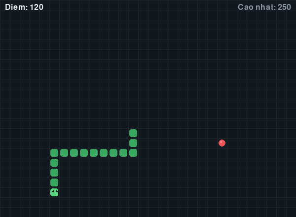
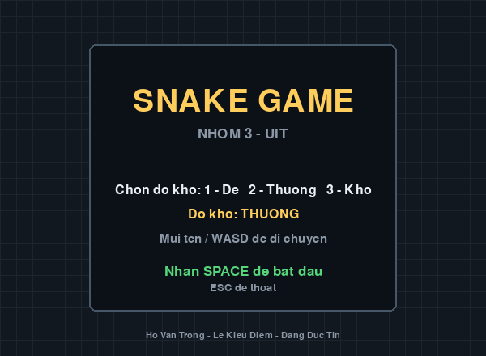
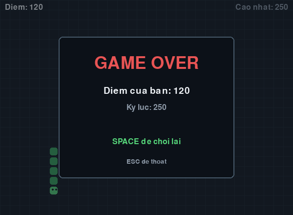

# 🐍 Snake Game — Đồ án nhóm UIT

Game rắn săn mồi kinh điển, viết bằng **Python + Pygame**.
Đồ án môn học của nhóm 3 thành viên, Trường Đại học Công nghệ Thông tin — ĐHQG TP.HCM.



---

## 👥 Thành viên nhóm

| # | Họ và tên | MSSV | Vai trò | Phụ trách | File |
|---|-----------|------|---------|-----------|------|
| 1 | Hồ Văn Trọng | 26730077 | Nhóm trưởng | Vòng lặp game, trạng thái, điều khiển, va chạm, tính điểm, quản lý repo | `game.py` |
| 2 | Lê Kiều Diễm | 26730010 | Thành viên | Đối tượng rắn và mồi, xử lý di chuyển, sinh mồi ngẫu nhiên | `snake.py`, `food.py` |
| 3 | Đặng Đức Tín | 26730073 | Thành viên | Toàn bộ giao diện, menu, game over, âm thanh, bảng màu | `ui.py`, `config.py` |

Nhóm chia việc theo file để ba người làm song song mà không đụng vào cùng một dòng code. Chi tiết:

- Bảng phân công: [docs/PHAN-CONG.md](docs/PHAN-CONG.md)
- Mô tả công việc từng người: [docs/MO-TA-CONG-VIEC.md](docs/MO-TA-CONG-VIEC.md)
- Sơ đồ trạng thái và sơ đồ lớp: [docs/SO-DO.md](docs/SO-DO.md)

---

## 🎮 Tính năng

- [x] Rắn di chuyển bằng phím mũi tên hoặc WASD
- [x] Sinh mồi ngẫu nhiên, ăn mồi thì rắn dài ra và cộng 10 điểm
- [x] Va chạm tường và va chạm thân rắn → thua
- [x] Hiển thị điểm hiện tại và điểm cao nhất, có báo khi phá kỷ lục
- [x] Lưu điểm cao nhất ra file, mở lại game vẫn còn
- [x] Màn hình menu, tạm dừng (phím `P`), game over
- [x] Ba mức độ khó: Dễ, Thường, Khó (8 / 12 / 18 bước mỗi giây)
- [x] Âm thanh khi ăn mồi và khi thua

### Điều khiển

| Phím | Tác dụng |
|------|----------|
| `↑` `↓` `←` `→` hoặc `W` `A` `S` `D` | Lái rắn |
| `1` `2` `3` | Chọn mức độ khó (ở màn hình menu) |
| `Space` | Bắt đầu / chơi lại |
| `P` | Tạm dừng |
| `Esc` | Thoát |

---

## 🚀 Cách chạy game

Yêu cầu: **Python 3.10 trở lên**.

```bash
# 1. Tải code về
git clone https://github.com/tronghv77/snake-game-uit.git
cd snake-game-uit

# 2. Tạo môi trường ảo
python -m venv .venv

# 3. Kích hoạt môi trường ảo
# Windows (PowerShell):
.venv\Scripts\Activate.ps1
# macOS / Linux:
source .venv/bin/activate

# 4. Cài thư viện
pip install -r requirements.txt

# 5. Chạy game
python main.py
```

Game hiện màn hình menu, chọn độ khó bằng phím `1` `2` `3` rồi nhấn `Space` để chơi.

---

## 🖼️ Một số màn hình

| Menu | Game over |
|------|-----------|
|  |  |

---

## 🧪 Kiểm thử

Dự án có **42 bài kiểm thử tự động**, chạy được cả trên máy không có màn hình:

```bash
python -m pytest -v
```

Các bài kiểm thử bao gồm: chuyển trạng thái game, ánh xạ phím, nhịp đi của rắn không lệch theo thời gian, đọc ghi điểm cao nhất khi file hỏng hoặc thiếu, ăn mồi cộng điểm, va chạm đủ bốn bức tường, và rắn cắn thân mình.

> Ghi chú: GitHub Actions đang tắt tạm thời vì lý do ngoài kỹ thuật, xem [docs/VE-CI.md](docs/VE-CI.md).
> Cả nhóm chạy `pytest` ở máy trước mỗi Pull Request.

---

## 📁 Cấu trúc thư mục

```
snake-game-uit/
├── main.py              # File chạy game
├── requirements.txt     # Thư viện cần cài
├── src/snake/
│   ├── config.py        # Hằng số: kích thước, màu sắc, tốc độ      (Tín)
│   ├── game.py          # Vòng lặp, trạng thái, va chạm, tính điểm  (Trọng)
│   ├── snake.py         # Lớp Snake — thân rắn, di chuyển           (Diễm)
│   ├── food.py          # Lớp Food — sinh mồi ngẫu nhiên            (Diễm)
│   └── ui.py            # Vẽ rắn, mồi, điểm, menu, game over        (Tín)
├── assets/              # Hình ảnh, âm thanh, font chữ
├── tests/               # 42 bài kiểm thử
└── docs/                # Tài liệu, sơ đồ thiết kế
```

### Về thiết kế

`Snake` và `Food` **không biết pygame là gì** — hai lớp này chỉ làm việc với toạ độ ô lưới dạng `(x, y)`, không đụng tới pixel hay màn hình. Nhờ vậy có thể kiểm thử tự động mà không cần mở cửa sổ game.

Ngược lại, `ui` chỉ biết vẽ, không biết luật chơi. Ranh giới giữa *logic* và *hiển thị* là lý do nhóm đổi được toàn bộ bảng màu mà không làm hỏng luật chơi, và ngược lại.

Xem [docs/SO-DO.md](docs/SO-DO.md) để có sơ đồ lớp và sơ đồ trạng thái đầy đủ.

---

## 🤝 Quy trình làm việc nhóm

**Không ai push thẳng lên nhánh `main`.** Mọi thay đổi đều đi qua Pull Request và cần một thành viên khác duyệt.

```bash
git checkout main
git pull origin main
git checkout -b feat/ten-tinh-nang
# ... code ...
git add .
git commit -m "feat: mô tả ngắn việc đã làm"
git push -u origin feat/ten-tinh-nang
```

- Hướng dẫn Git cho người mới bắt đầu: [docs/HUONG-DAN-GIT.md](docs/HUONG-DAN-GIT.md)
- Quy tắc đóng góp: [CONTRIBUTING.md](CONTRIBUTING.md)

---

## 📄 Giấy phép

[MIT License](LICENSE)
