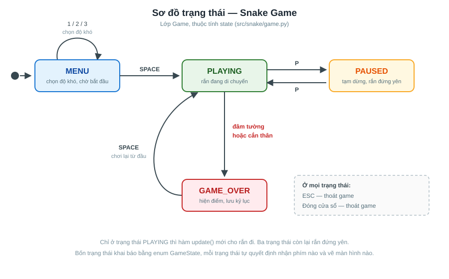
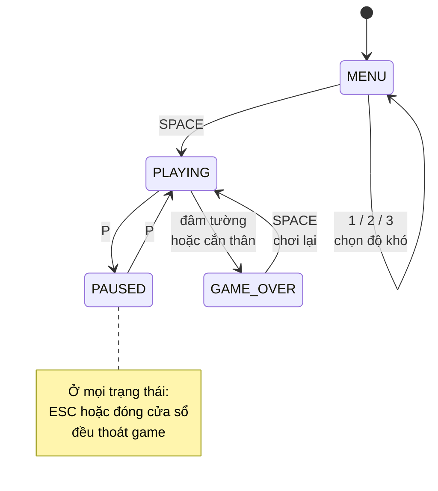
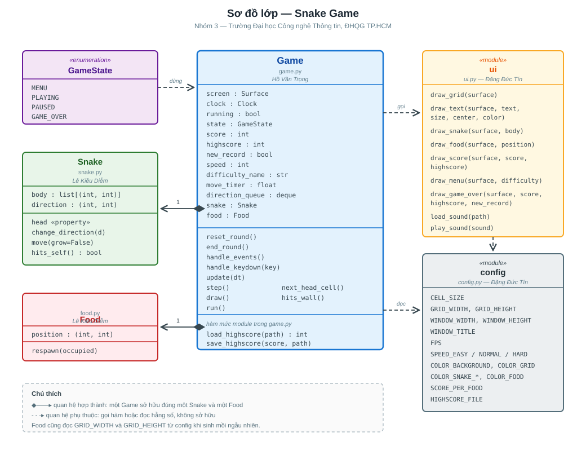
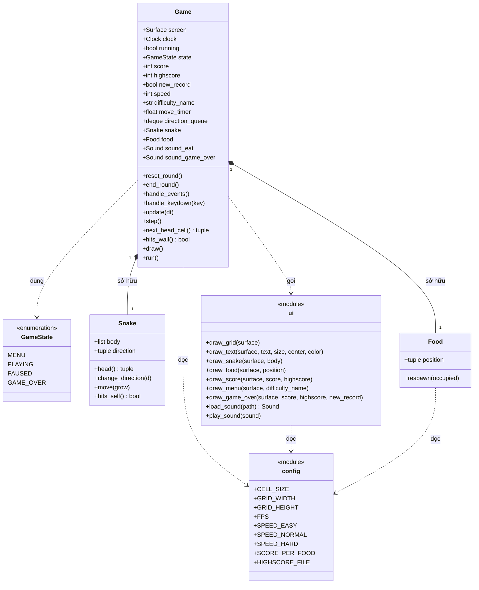

# Sơ đồ thiết kế

Tài liệu này phục vụ phần "Phân tích và thiết kế" của báo cáo đồ án.
Cập nhật: 09/09/2026 — khớp với code trên nhánh `main` sau khi gộp đủ phần của cả ba thành viên.

Mỗi sơ đồ có hai bản:

- **File SVG** trong `docs/images/` — chèn thẳng vào Word được (Word 2016 trở lên
  nhận SVG), phóng to bao nhiêu cũng không vỡ nét. Đây là bản dùng cho báo cáo.
- **Mã Mermaid** ngay dưới đây — GitHub tự vẽ khi xem trên web, ai muốn sửa thì
  sửa vài dòng chữ là xong, không cần phần mềm vẽ.

> ⚠️ Sửa code thì nhớ cập nhật lại cả hai bản, đừng để sơ đồ nói một đằng code
> làm một nẻo.

---

## 1. Sơ đồ trạng thái

### Diễn giải (dùng cho báo cáo)

Game được tổ chức theo mô hình **máy trạng thái hữu hạn**. Tại mỗi thời điểm,
game chỉ nằm ở đúng một trong bốn trạng thái, khai báo bằng `enum GameState`
trong `src/snake/game.py`:

| Trạng thái | Ý nghĩa | Rắn có di chuyển không |
|-----------|---------|----------------------|
| `MENU` | Màn hình đầu, chọn mức độ khó | Không |
| `PLAYING` | Đang chơi | Có |
| `PAUSED` | Tạm dừng giữa ván | Không |
| `GAME_OVER` | Đã thua, hiện điểm và kỷ lục | Không |

Cách tổ chức này giải quyết một vấn đề rất thực tế: cùng một phím bấm nhưng ý
nghĩa khác nhau tuỳ hoàn cảnh. Phím `SPACE` ở `MENU` nghĩa là "bắt đầu", ở
`GAME_OVER` nghĩa là "chơi lại", còn khi đang `PLAYING` thì không có tác dụng gì.
Nếu không tách trạng thái, đoạn xử lý phím sẽ biến thành một chuỗi `if` lồng nhau
rất khó đọc và khó sửa.

Hai hàm `update()` và `draw()` đều bắt đầu bằng việc kiểm tra `self.state` rồi rẽ
nhánh. Nhờ vậy, muốn thêm một trạng thái mới — ví dụ màn hình xem bảng xếp hạng —
chỉ cần thêm một nhánh, không phải sửa chỗ nào khác.

### Mã Mermaid

---

## 2. Sơ đồ lớp

### Diễn giải (dùng cho báo cáo)

Chương trình chia thành **năm thành phần**, mỗi thành phần một file, ranh giới
trùng luôn với ranh giới phân công công việc trong nhóm. Cách chia này giúp ba
thành viên làm song song mà gần như không bao giờ đụng vào cùng một dòng code.

| Thành phần | File | Vai trò | Người phụ trách |
|-----------|------|---------|----------------|
| `Game` | `game.py` | Điều phối: nhận phím, giữ nhịp, tính điểm, quyết định vẽ gì | Hồ Văn Trọng |
| `GameState` | `game.py` | Kiểu liệt kê bốn trạng thái | Hồ Văn Trọng |
| `Snake` | `snake.py` | Thân rắn và hành vi di chuyển | Lê Kiều Diễm |
| `Food` | `food.py` | Vị trí miếng mồi | Lê Kiều Diễm |
| `ui` | `ui.py` | Toàn bộ việc vẽ lên màn hình | Đặng Đức Tín |
| `config` | `config.py` | Hằng số dùng chung: kích thước, màu, tốc độ | Đặng Đức Tín |

**Về quan hệ giữa các thành phần.** `Game` sở hữu đúng một `Snake` và một `Food`
— quan hệ hợp thành, hai đối tượng này sinh ra và mất đi cùng với ván chơi, thể
hiện bằng hình thoi đặc trên sơ đồ. Với `ui` và `config`, `Game` chỉ *gọi hàm* và
*đọc hằng số* chứ không sở hữu gì, nên vẽ bằng nét đứt.

**Điểm đáng nói về thiết kế.** `Snake` và `Food` hoàn toàn không biết pygame là
gì. Hai lớp này chỉ làm việc với toạ độ ô lưới dạng `(x, y)`, không đụng tới
pixel, không đụng tới màn hình. Nhờ vậy có thể viết kiểm thử tự động cho chúng
mà không cần mở cửa sổ game — đó là lý do bộ test của nhóm chạy được cả trên máy
chủ không có màn hình.

Ngược lại, `ui` chỉ biết vẽ, không biết luật chơi. Nó nhận vào danh sách toạ độ
rồi tô màu, không quan tâm rắn đang sống hay đã chết. Ranh giới rạch ròi giữa
"logic" và "hiển thị" này là lý do đổi toàn bộ bảng màu hay thay hình vẽ không
làm hỏng luật chơi, và ngược lại.

### Mã Mermaid

---

## Cách đưa sơ đồ vào báo cáo Word

1. Mở Word, vào **Insert → Pictures → This Device**
2. Chọn file `docs/images/so-do-trang-thai.svg` hoặc `so-do-lop.svg`
3. Word chèn dạng vector, phóng to thu nhỏ không vỡ nét

Nếu bản Word cũ không nhận SVG: mở file SVG bằng trình duyệt, phóng to cỡ 150%
rồi chụp màn hình. Hoặc mở file trên GitHub, bản Mermaid sẽ được vẽ sẵn để chụp.

## Trạng thái

Sơ đồ khớp hoàn toàn với code trên `main`. Cả ba phần đã gộp xong và game chạy
được trọn vẹn: rắn di chuyển, ăn mồi, va chạm, tính điểm, lưu kỷ lục, có âm thanh.

Khi sửa code nhớ cập nhật lại cả hai bản sơ đồ — file SVG trong `docs/images/`
và mã Mermaid ở trên — để sơ đồ không nói một đằng code làm một nẻo.
